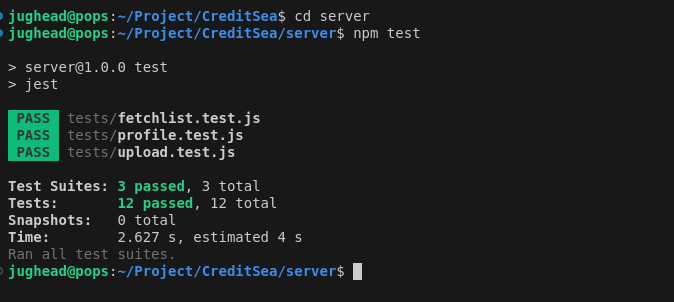
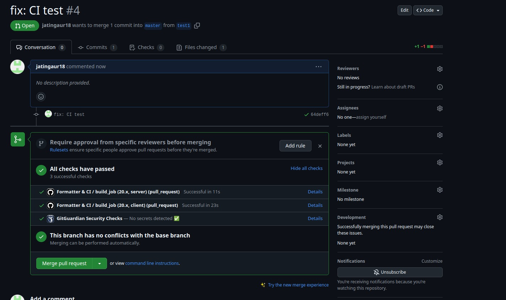

# CreditSea Full-Stack Credit Report Processing System

A full-stack MERN application that processes XML files containing soft credit pull data from Experian, extracts relevant information, and presents it in a comprehensive report format.

## 🌟 Live Demo

- video demo: [https://drive.google.com/file/d/110zab3gQPyEILjDerIrw4Rx3XXG56XbQ/view]

The application is deployed on Google Cloud Platform (GCP):
- WEBSITE: [http://34.93.128.239:5000/]

## 🚀 Features

- XML file upload and validation
- Automated data extraction from Experian credit reports
- MongoDB data persistence
- Comprehensive credit report visualization
- Docker containerization
- Automated testing with Jest

- CI/CD pipeline using GitHub Actions

## 🛠 Tech Stack

- **Frontend**: React.js
- **Backend**: Node.js, Express.js
- **Database**: MongoDB
- **Testing**: Jest
- **Deployment**: Docker, Google Cloud Platform
- **CI/CD**: GitHub Actions

## 📋 Prerequisites

- Node.js (v20.x)
- Docker
- MongoDB
- Google Cloud SDK (for deployment)

## 🔄 CI/CD Pipeline

The project uses GitHub Actions for CI/CD:

- Automated testing on pull requests
- Code formatting checks

